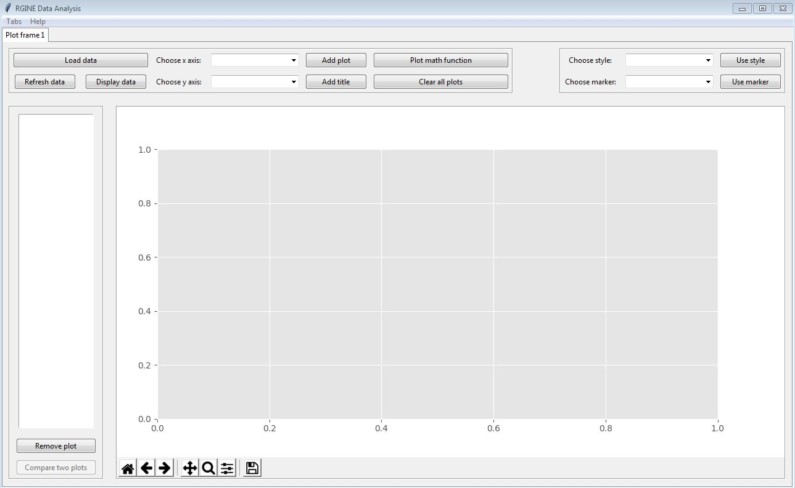

**RAnalysis**
-------------

A python tools to display / plot data from csv files.



-------------
### Dependencies

Install Python 3.7+ and matplotlib library.

### Data format

| Variable 1 | Variable 2 | Variable 3 | Variable 4 | ... |
|------------|------------|------------|------------|-----|
| unit       | unit       | unit       | unit       | ... |
| value      | value      | value      | value      | ... |
| value      | value      | value      | value      | ... |
| ...        | ...        | ...        | ...        | ... |

*Note*: By default the delimiter of the csv column is ";" but you can use anything you want.
It is important to notice the content of the line in the csv file:

- First line : Name of the variable (string)
- Second line (optional) : Unit of the variable (string) 
- Other lines : Value of the variable (int or float)

### Standalone

#### GUI

Clone the repository or download a zip file from Gitlab, go to the folder and simply run the following command in the *cmd* (Windows) or *terminal* (Linux / MacOs):

	python ranalysis.py -gui

#### CLI

Clone the repository or download a zip file from Gitlab, go to the folder and simply run one of the following command in the *cmd* (Windows) or *terminal* (Linux / MacOs):
    
    # Display variable x and variable y in a plot
	python ranalysis.py -f <path_to_csv_file> -x <x_variable_name> -y <y_variable_name>
	# Display variable x and variables y1, y2, ...  in a plot
	python ranalysis.py -f <path_to_csv_file> -x <x_variable_name> -my <y_variable_name1,y_variable_name2>
	# Display usage / help
	python ranalysis.py -h

### Library

#### Generate the library

Clone the repository or download a zip file from Gitlab, go to the folder and simply run the following command in the *cmd* (Windows) or *terminal* (Linux / MacOs):

    # Build RAnalysis source distribution package
    python setup.py sdist
    # Build RAnalysis binary distribution package (example with Windows below)
    python setup.py bdist
    python setup.py bdist --formats=wininst
    # Generate RAnalysis pydoc
    pydoc -w <name>

#### Install the library

From the **dist** folder, copy the content of the zip file in your *site-packages* folder (it can be found in the *lib* Python folder) or use the exe file (only for Windows).

#### Use the library (How to ?)

##### Launch the GUI

```python
from ranalysis.gui.ranalysisframe import RAnalysisFrame

app = RAnalysisFrame(None)
app.mainloop()
```

##### Read CSV file

To manage data from csv file (as defined previously), it is possible to use the DataManager object:

```python
from ranalysis.data.datamanager import DataManager

options = {'delimiter': ';', 'unit': 1}

data_manager = DataManager()
data_manager.read_csv_file(file_path, options)
```

After, you have access to:

```python
data_manager.get_data_tuple()  # Get the data as a list of tuple
data_manager.get_field_names() # Get the list of data field names
data_manager.get_unit_from_field_name(field_name) # Get unit from data field name
data_manager.get_data_from_field_name(field_name) # Get data from data field name
```

##### Create Plot object

You can use PlotCreator (singleton) object to create plot object (matplotlib plot):

```python
from ranalysis.plot.plotcreator import PlotCreator

plot_factory = PlotCreator.get_instance()

plot = plot_factory.plot_from_function(function, xmin, xmax, discr, xlabel, ylabel)
plot = plot_factory.plot_from_fieldname(data_manager, x_data_name, y_data_name)
plot = plot_factory.plot_from_fieldnames(data_manager, x_data_name, y_data_names)
plot = plot_factory.plot_from_data(x_data, y_data, x_axis, y_axis, x_unit, y_unit)
plot = plot_factory.plot_from_multiple_data(x_data, y_multiple_data, x_axis, y_multiple_axis, x_unit, y_unit)
```

##### Use graph functions

```python
import matplotlib.pyplot as plt

fig, ax = plt.subplots()

graph_from_function(ax, function_list, marker)
graph_from_function(ax, function, xmin, xmax, discr, xlabel, ylabel, marker)
graph_from_fieldname(ax, manager, x_fieldname, y_fieldname, marker)
graph_from_fieldnames(ax, manager, x_fieldname, y_fieldnames, marker)
graph_from_plots(ax, list_plots, marker)
graph_from_plot_ids(ax, plot_ids, marker)
graph_from_data(ax, x_data, y_data, x_label, y_label, marker)
graph_from_multiple_data(ax, x_data, y_datas, x_label, y_multiple_label, marker)
graph_add_title(ax, title)
graph_compare_plot(ax, plot1, plot2, marker)
graph_compare_plot_diff(ax, plot1, plot2)
graph_compare_plot_values(ax, plot1, plot2)
graph_clear(ax)

plt.show()
```

##### Plot data

To ease the display of a graph from data, you can use CliHandler object:

```python
from ranalysis.cli.clihandler import CliHandler

cli_handler = CliHandler(file_path, options)

cli_handler.show_from_function(function, xmin, xmax, discr, xlabel, ylabel)
cli_handler.show_from_fieldname(x_fieldname, y_fieldname)
cli_handler.show_from_fieldnames(x_fieldname, y_fieldnames)
```
